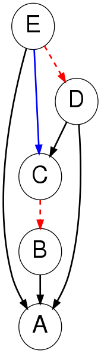

# BayNet

BayNet is a Python library for generating, sampling data from, comparing, and visualising Bayesian Networks.

## Installation
```bash
pip install BayNet
```

## Usage
### Generate a 10-node Forest Fire DAG, and parameters, then sample data from it:
```python
from baynet import DAG
dag = DAG.forest_fire(10, .5, seed=1) # Creates a DAG
dag.generate_parameters(seed=1) # Samples parameters for each node
data = dag.sample(1_000) # Samples data, returning a pandas DataFrame
```
### Generate a 5-node Barabasi-Albert (preferential attachment) graph and plot it:
```python
from baynet import DAG
DAG.barabasi_albert(5, seed=1).plot() # Saves 'DAG.png' in working directory
```


### Generate two 5-node Erdos-Renyi DAGs and compare them:
```python
from baynet import DAG, metrics
dag_1 = DAG.erdos_renyi(5, 0.5, seed=1)
dag_2 = DAG.erdos_renyi(5, 0.5)
print(metrics.shd(dag_1, dag_2)) # prints DAG SHD, in this case 6
print(metrics.shd(dag_1, dag_2, skeleton=True)) # prints skeleton SHD, in this case 3
dag_1.compare(dag_2).plot() # saves 'comparison.png' in working directory
```


Taking dag_1 to be the ground truth and dag_2 to be a structure learning result:
- Dashed red arcs represent false negatives
- Blue arcs are represent positives
- Green arcs represent incorrectly directed arcs


